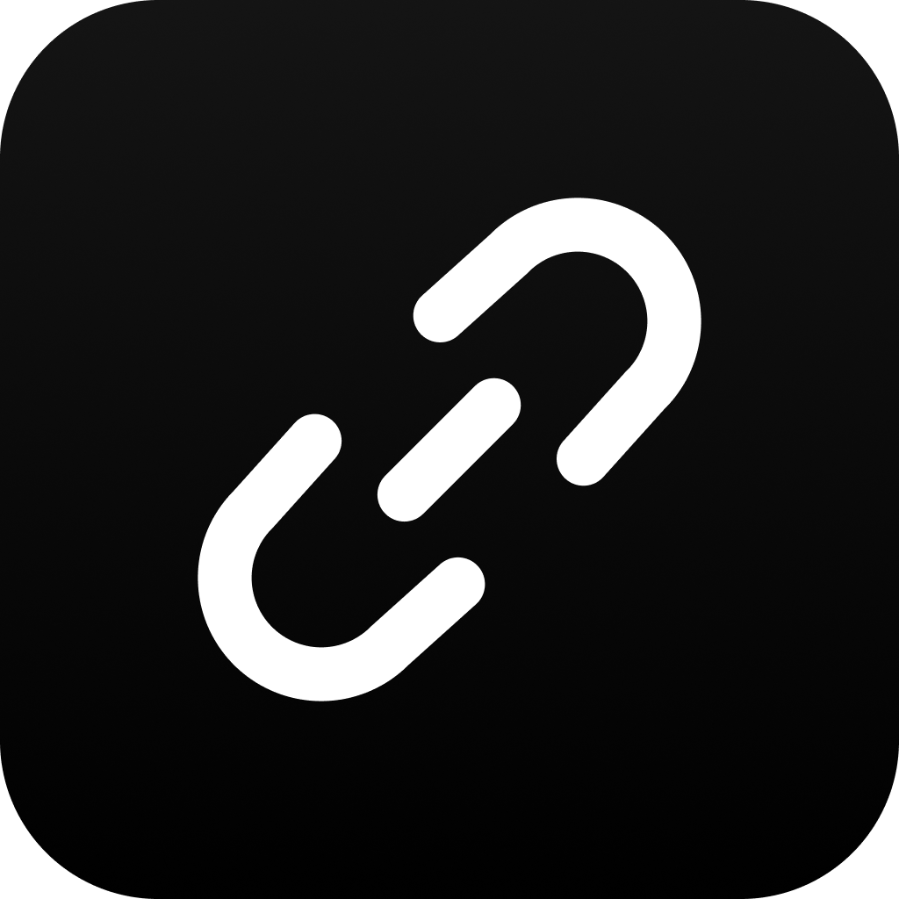

<p align="center">
  
</p>

<h1 align="center">🔗 Links</h1>

<p align="center">
  A modern, customizable, and responsive <strong>Link-in-Bio</strong> platform built with <strong>Next.js</strong> and <strong>Tailwind CSS</strong>. Create a beautiful personal landing page to showcase your social profiles, portfolio, business, and everything that matters in one place.
</p>

<p align="center">
  
  
  
</p>

---

## ✨ Features

- 🚀 Built with Next.js for high performance
- 🎨 Modern UI powered by Tailwind CSS
- 📱 Fully responsive across all devices
- 🔗 Unlimited social and custom links
- ⚡ Fast and lightweight
- 🌙 Easy to customize and extend
- 🛠 Clean project structure
- 📈 Perfect for creators, developers, businesses, and personal brands

---

## 📦 Getting Started

Follow these steps to run the project locally.

### 1. Clone the repository

```bash
git clone https://github.com/braviaprime/links.git
```

### 2. Navigate into the project

```bash
cd links
```

### 3. Install dependencies

```bash
pnpm install
```

### 4. Start the development server

```bash
pnpm dev
```

The application will be available at:

```
http://localhost:3000
```

---

## 🛠 Tech Stack

- Next.js
- React
- Tailwind CSS
- TypeScript
- PNPM

---

## 📂 Project Structure

```text
.
├── app/
├── components/
├── lib/
├── public/
├── styles/
├── package.json
└── README.md
```

---

## 🤝 Contributing

Contributions, issues, and feature requests are welcome.

1. Fork the repository.
2. Create your feature branch.

```bash
git checkout -b feature/amazing-feature
```

3. Commit your changes.

```bash
git commit -m "Add amazing feature"
```

4. Push to the branch.

```bash
git push origin feature/amazing-feature
```

5. Open a Pull Request.

---

## 📄 License

This project is licensed under the MIT License.

---

<p align="center">
Made with ❤️ by Braviaprime
</p>